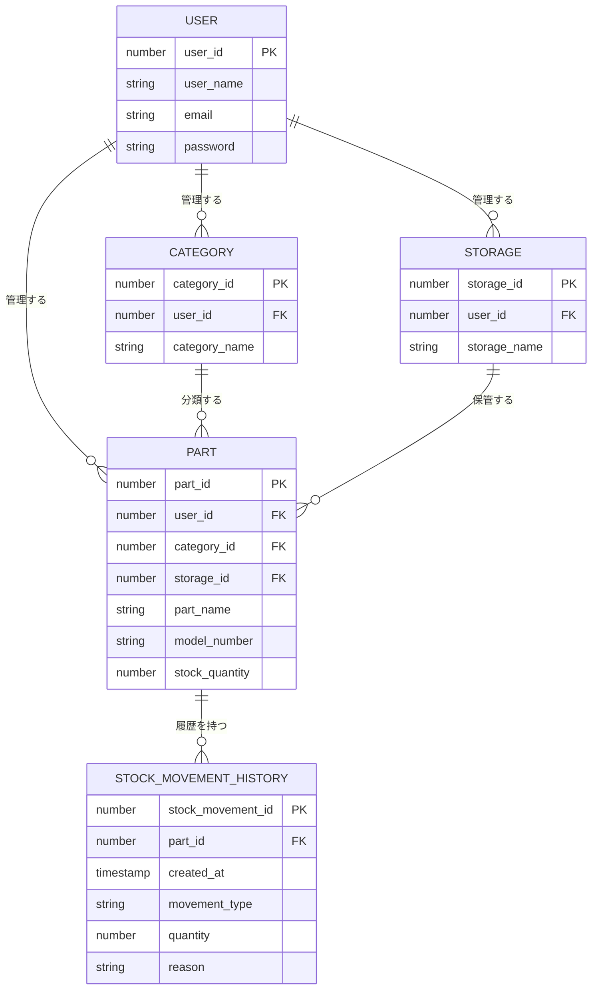

# ER図

## ユーザー

### エンティティの役割
CircuitStockを利用するユーザーを表す

### 主要属性
- ユーザーID
 → ユーザーを一意に識別するため
- ユーザー名
 → ログイン後にユーザーを表示・識別するため
- メールアドレス
 → ログイン時の照合に使用するため
- パスワード
 → 認証に使用するため

### 正規化の確認
- 各属性は1つの値を持ち、ユーザーに直接関係する情報として管理する
- 他エンティティとの重複もないため、現時点では分割不要

### キーの整理
#### 主キー
- ユーザーID

#### 外部キー
- なし

#### その他の属性
- ユーザー名
- メールアドレス
- パスワード

## カテゴリ

### エンティティの役割
部品を分類するためのカテゴリを表す

### 主要属性
- カテゴリID 
 → カテゴリを一意に識別するため
- ユーザーID
 → カテゴリを管理するユーザーを識別するため
- カテゴリ名
 → カテゴリを表示・識別する

### 正規化の確認
- 各属性は1つの値を持ち、カテゴリに直接関係する情報として管理する
- 他エンティティとの重複もないため、現時点では分割不要

### キーの整理
#### 主キー
- カテゴリID

#### 外部キー
- ユーザーID
 → ユーザーを参照

#### その他の属性
- カテゴリ名

## 保管場所

### エンティティの役割
部品の所在を把握するための保管場所を表す

### 主要属性
- 保管場所ID 
 → 保管場所を一意に識別するため
- ユーザーID
 → 保管場所を管理するユーザーを識別するため
- 保管場所名
 → 保管場所を表示・識別する

### 正規化の確認
- 各属性は1つの値を持ち、保管場所に直接関係する情報として管理する
- 他エンティティとの重複もないため、現時点では分割不要

### キーの整理
#### 主キー
- 保管場所ID

#### 外部キー
- ユーザーID
 → ユーザーを参照

#### その他の属性
- 保管場所名

## 部品

### エンティティの役割
CircuitStockで管理する部品を表す

### 主要属性
- 部品ID
 → 部品を一意に識別するため 
- 製品名
 → 部品を表示・識別するため
- 型番
 → 型番によって同名・類似の部品を識別するため
- ユーザーID
 → 部品を管理するユーザーを識別するため
- カテゴリID
 → 部品がどのカテゴリに属するかを識別するため
- 保管場所ID
 → 部品がどこに保管されているかを識別するため
- 在庫数
 → 現在保持している部品数を管理するため

### 正規化の確認
- 各属性は1つの値を持つ
- 製品名・型番・在庫数は部品に直接関係する情報として管理する
- カテゴリ名はカテゴリ側だけで管理し、部品はカテゴリIDで参照する
- 保管場所名は保管場所側だけで管理し、部品は保管場所IDで参照する
- 重複して保持する情報はないため、現時点では分割不要

### キーの整理
#### 主キー
- 部品ID

#### 外部キー
- ユーザーID
 → ユーザーを参照
- カテゴリID
 → カテゴリを参照
- 保管場所ID
 → 保管場所を参照

#### その他の属性
- 製品名
- 型番
- 在庫数

## 入出庫履歴

### エンティティの役割
CircuitStockで管理する部品の入庫・出庫の履歴を表す

### 主要属性
- 入出庫ID
 → 入出庫履歴を一意に識別するため
- 作成日時
 → いつ入庫・出庫をしたか記録するため
- 部品ID
 → 入出庫した部品を識別するため
- 入出庫区分
 → 入庫か出庫かを識別するため
- 数量
 → 在庫数の増加・減少を管理するため
- 理由
→ 入庫・出庫を行った理由を記録するため

### 正規化の確認
- 各属性は1つの値を持つ
- 作成日時・入出庫区分・数量・理由は入出庫履歴に直接関係する情報として管理する
- 部品名や型番は部品側だけで管理し、入出庫履歴は部品IDで参照する
- 重複して保持する情報はないため、現時点では分割不要

### キーの整理
#### 主キー
- 入出庫ID

#### 外部キー
- 部品ID
 → 部品を参照

#### その他の属性
- 作成日時
- 入出庫区分
- 数量
- 理由

## リレーションシップ

### ユーザー ― カテゴリ
- 関係：カテゴリはユーザーごとに管理する
- 関係に使用する属性：カテゴリのユーザーID
- カーディナリティ：1対多
  - 1人のユーザーは複数のカテゴリを持てる
  - 1つのカテゴリは1人のユーザーに属する

### ユーザー ― 保管場所
- 関係：保管場所はユーザーごとに管理する
- 関係に使用する属性：保管場所のユーザーID
- カーディナリティ：1対多
  - 1人のユーザーは複数の保管場所を持てる
  - 1つの保管場所は1人のユーザーに属する

### ユーザー ― 部品
- 関係：部品はユーザーごとに管理する
- 関係に使用する属性：部品のユーザーID
- カーディナリティ：1対多
  - 1人のユーザーは複数の部品を持てる
  - 1つの部品は1人のユーザーに属する

### カテゴリ ― 部品
- 関係：部品はカテゴリに属する
- 関係に使用する属性：部品のカテゴリID
- カーディナリティ：1対多
  - 1つのカテゴリは複数の部品を持てる
  - 1つの部品は1つのカテゴリに属する

### 保管場所 ― 部品
- 関係：部品は保管場所に保管される
- 関係に使用する属性：部品の保管場所ID
- カーディナリティ：1対多
  - 1つの保管場所は複数の部品を持てる
  - 1つの部品は1つの保管場所に属する

### 部品 ― 入出庫履歴
- 関係：入出庫履歴は対象となる部品を記録する
- 関係に使用する属性：入出庫履歴の部品ID
- カーディナリティ：1対多
  - 1つの部品は複数の入出庫履歴を持てる
  - 1つの入出庫履歴は1つの部品に属する

